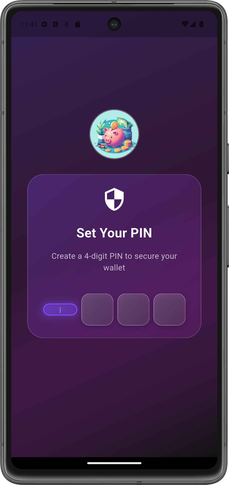
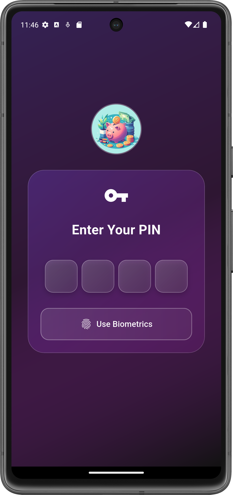
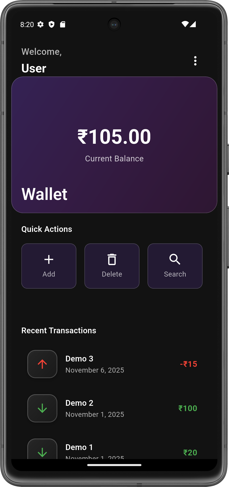
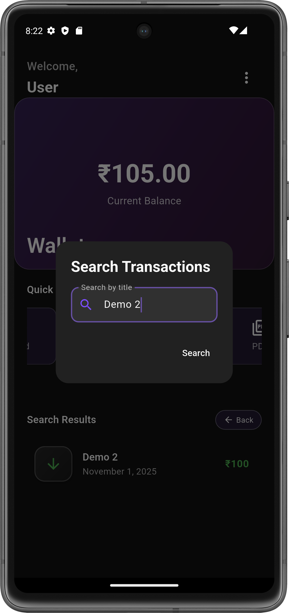
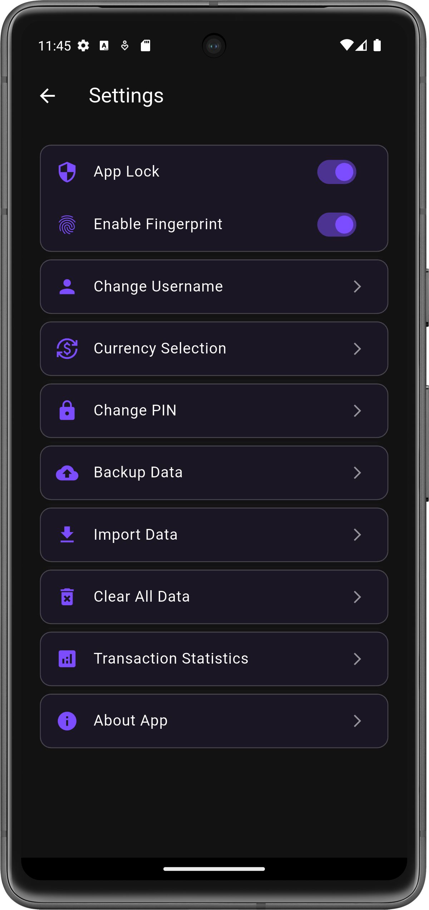

# Piggy 🐷 — Android Flutter App

### A Flutter-based Android application for effortless personal finance management
**Track income, expenses, and manage daily transactions with a clean, modern interface**

--- 

## 📱 App Versions

### 🧾 Piggy v1.0.0 - Basic Edition
- Add, view, and delete transactions
- Real-time balance calculation
- Dark theme UI
- Local storage using SQLite
- Export financial data

### 🔐 Piggy v1.0.1 - Secure Edition
- Secure authentication system (Login/Signup)
- Enhanced and modern user interface
- Additional data security features
- Improved transaction management
- Advanced customization and settings

### 🧬 Piggy v1.0.2 – Biometric Edition
- Fingerprint biometric authentication  
- Enable / Disable biometric login from settings  
- Secure app access using device-level biometrics  
- Fallback to PIN / password when biometrics are disabled  
- Improved security flow and session handling  
- All features from previous versions included    

## 🚀 Key Features

- **Transaction Management** — Add, view, edit, and delete financial records  
- **Balance Tracking** — Real-time balance updates  
- **Dark Theme** — Elegant, modern UI design  
- **Offline Ready** — Works fully without internet  
- **Data Export** — Export transaction records instantly  
- **Optimized** — Smooth and responsive Android experience 

## 🛠️ Tech Stack

| Technology | Purpose |
|------------|----------|
| **Flutter** | Cross-platform UI framework |
| **Dart** | Core programming language |
| **SQLite** | Local database for offline storage |
| **Biometric API** | Fingerprint authentication |
| **Material Design** | Clean and modern UI components |

## 📥 Installation

### 📱 Quick Install (Recommended)

1. Download the APK from the [Releases](../../releases) section:
   - `Piggy_v1.0.0.apk` (Basic Edition)
   - `Piggy_v1.0.1.apk` (Secure Edition)
   - `Piggy_v1.0.2.apk` (Biometric Edition)

2. Install on your Android device
3. Enable **Fingerprint Permission** on first launch (v1.0.2)

### 🛠️ Development Setup

#### Prerequisites
- Flutter SDK (latest stable)
- Dart SDK
- Android Studio or VS Code
- Android device/emulator
- Git

#### Installation Steps

```bash
# Clone the repository
git clone https://github.com/Ashwinssushil/Piggy-wallet.git
cd Piggy-wallet
```
```bash
# Navigate to desired version
cd Piggy_v1.0.2
# or
cd Piggy_v1.0.1
# or
cd Piggy_v1.0.0
```
```bash
# Install dependencies
flutter pub get

# Run the app
flutter run
```

## 🖼️ Screenshots
<div align="center">
  
  
  
  
  
  
</div>


## 👨‍💻 Author

- 📧 Email: [u337744@gmail.com](mailto:u337744@gmail.com)
- 🐙 GitHub: [@Ashwinssushil](https://github.com/Ashwinssushil)

## 📞 Support

Have questions or need help? [Open an issue](../../issues) in this repository.

---

**⭐ Star this repository if you found it helpful!**
